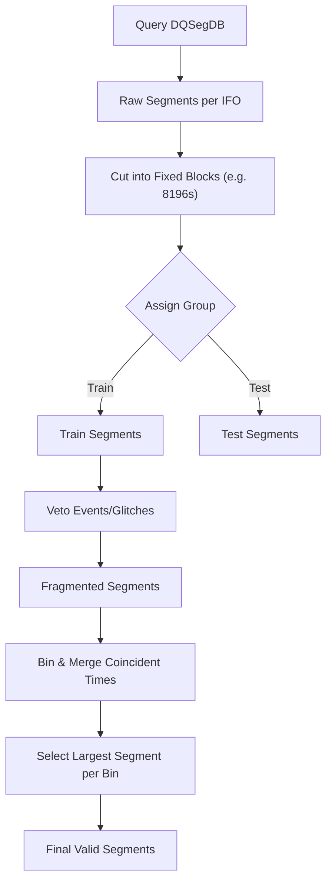

# Gravyflow Acquisition Process

This document provides a detailed explanation of the data acquisition process in `gravyflow`, specifically focusing on how the `IFODataObtainer` selects, splits, and groups time segments for noise and feature acquisition.

## High-Level Overview

The acquisition process is designed to retrieve valid, high-quality data segments from gravitational wave detectors (IFOs) like LIGO. The process ensures that:
1.  Data is available for all requested detectors simultaneously (coincident time).
2.  Data meets specific quality criteria (state flags).
3.  Segments are split into manageable chunks for training, validation, and testing.
4.  Unwanted periods (glitches, known events) are vetoed or handled appropriately.
5.  For noise acquisition, long segments are prioritized to maximize the number of background samples.

## The Segment Selection Pipeline

The core logic resides in the `get_valid_segments` method of the `IFODataObtainer` class. Here is the step-by-step flow:

### 1. Initial Retrieval (`get_all_segment_times`)
The process begins by querying the Data Quality Segment Database (DQSegDB) for each requested interferometer (e.g., H1, L1).
-   **Input**: Start/End GPS times for an observing run (e.g., O3), Detector (IFO), and State Flag (e.g., `DCS-ANALYSIS_READY_C01:1`).
-   **Operation**: Returns a list of `[start, end]` time pairs where the detector was active and the data quality was good.
-   **Result**: A list of valid segments for *one* detector.

### 2. Coincidence and Cutting (`cut_segments`)
To train a model on multi-detector data, we need times where *all* detectors were active.
-   **Splitting**: Before finding intersections, segments are often split into smaller, fixed-duration chunks (e.g., 8196 seconds) to facilitate consistent grouping later.
-   **Operation**: The `cut_segments` method takes long continuous segments and chops them into these fixed-size blocks.

### 3. Group Assignment (`get_segments_for_group`)
Data is deterministically assigned to `train`, `validate`, or `test` groups to ensure no leakage between them.
-   **Logic**: The timeline is divided into blocks (e.g., 8196s). Each block is hashed or assigned based on its time to a specific group.
-   **Example**: If the split is 98% train, 1% validate, 1% test, then for every 100 blocks, 98 go to training.
-   **Result**: A filtered list of segments that belong *only* to the requested group (e.g., "train").

### 4. Vetoing Unwanted Times (`remove_unwanted_segments`)
We often want to exclude times containing known glitches or gravitational wave events (unless we are specifically training on them).
-   **Inputs**: Lists of known event times (from catalogues like GWTC) and glitch times.
-   **Operation**:
    -   `pad_gps_times_with_veto_window`: Adds a safety buffer around each event/glitch time.
    -   `veto_time_segments`: Subtracts these veto windows from the valid segments. If a segment overlaps with a veto, the overlapping part is removed, potentially splitting the segment into two smaller ones.

### 5. Noise Acquisition Specifics (`merge_bins` & `largest_segments_per_bin`)
For noise background estimation, we prefer long, continuous segments to generate many random realizations.
-   **Problem**: After vetoing, we might have many tiny, fragmented segments.
-   **Binning**: The timeline is divided into "bins" of a maximum desired duration (e.g., 2048s).
-   **Merging (`merge_bins`)**: Segments from all detectors are aligned into these bins.
-   **Selection (`largest_segments_per_bin`)**: Within each bin, the algorithm finds the largest common interval where *all* detectors have valid data. This maximizes the usable coincident time for that specific window.
-   **Result**: A list of `[start, end]` pairs representing the best available coincident noise data for each time bin.

### 6. Final Ordering (`order_segments`)
Finally, the segments are ordered based on the user's preference:
-   **Random**: Shuffled for training variety.
-   **Chronological**: Useful for sequential analysis.
-   **Shortest First**: Sometimes used for debugging.

## Summary Diagram

This rigorous process ensures that the data fed into the machine learning model is clean, consistent, and strictly separated by dataset split.
